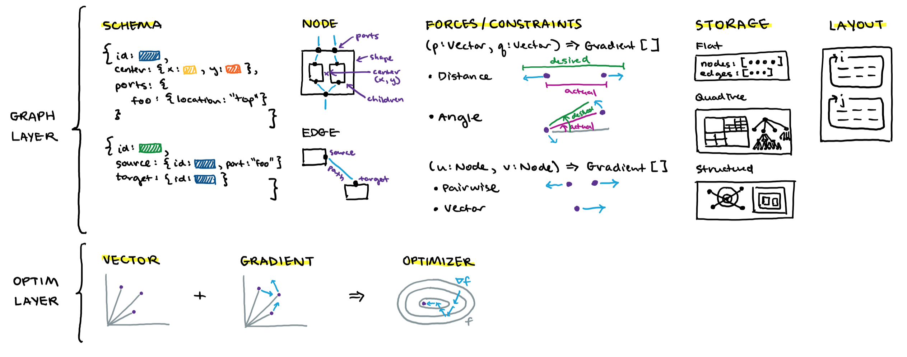

# Architecture

While the [API](/api) will provide you with the ground-truth documentation about all the abstractions in the library, it's useful to understand the big picture of how everything fits
together.

Nodal is built with a 2-level architecture:

## Low-level `optim` layer

Low-level manipulation of `Vector`s with `Gradient`s. An `Optimizer` provides a scheme for adjusting the learning rate multiplier on the gradient. We implemented a constant rate (`BasicOptimizer`) and adaptive (`TrustRegionOptimizer`) version, but also think it would be interesting to port some of the ideas from the ML field, e.g. `RMSPropOptimizer`, `AdamOptimizer`.

## High-level `graph` layer

Higher-level constructs like `Node` and `Edge` (produced from lightweight `NodeSchema` and `EdgeSchema`) are just collections of `Vector`s. Constraints and forces can be exerted on the `Vector`s through functions that generate `Gradient`s. The entire graph is stored in a `Storage` which may have different features including performant spatial lookup of elements and complex manipulation/traversal of the graph structure. A developer writes a `Layout`, which is a graph layout procedure, e.g. *i* iterations of force application, then *j* iteractions of constrain projection, repeated for *N* steps.