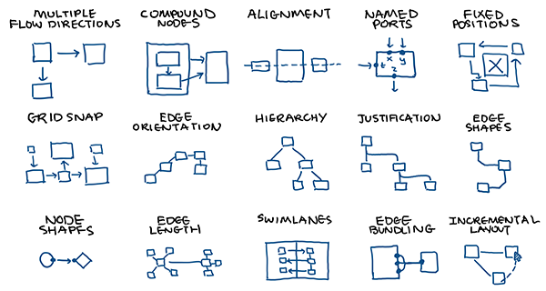

# Introduction

Nodal is a powerful open-source library for graph layout. It enables you to start building beautiful graphs immediately, or configure your own algorithm for any use case.

## Why?

There are plenty of graph layout libraries out there, why build another one? That's what we thought too when we first started working on our graph-heavy a project: one that required visualizing complex software structures like dependencies and computation graphs. But as we'd learn soon enough, there are many problems with existing libraries:

- **Simple layouts only.** Force-directed or single-direction DAG? No problem. Anything more complicated, like a multi-direction flowchart? Good luck.
- **Weird node/edge model.** Nodes, groups, leaves, edges, hierarchical edges? Often the abstractions introduce a lot of unnecessary complexity that the user has to shoulder.
- **Monolithic algorithms.** Beyond the configuration options provided, there's no way to modify parts of the algorithm or reuse parts of its code. 
- **Hard to tune aesthetics.** Want edges that only go at octilinear angles, like a metro map? You better hope the library developer wrote a layout for it. There's no way to modularly tweak aesthetics.
- **Buggy implementation.** Enough said.
- **Costly.** Sorry, we're not going to pay hundreds or thousands of dollars to use your closed-source software.

## Philosophy

- **Composable.**
Nodal allows you to build graph layouts by assembling small, predictable pieces (like points, forces, and constraints) into more complex structures and behaviors.

- **Hackable.**
Nodal is designed with an appreciation of the diversity of graph layout needs. Its elegant, well-documented abstractions are easy to extend or replace for domain-specific applications.

- **Intuitive.**
Nodal is based on gradient-descent rather than the inscrutable algorithms of traditional layout. This allows you to leverage physical and geometric intuitions while tuning your graphs.

## Features

**For graph designers:**
- Compound nodes
- Different shapes
- Named ports
- Edge angle snap
- Multidirectional flow
- Non-overlap constraints
- Constraints, e.g. alignment, distance
- Animation/interaction hooks

**For algorithm builders:**
- Small, composable abstractions.
- Layered architecture.
- Elegant, well-documented code.
- Open-source with MIT License.

